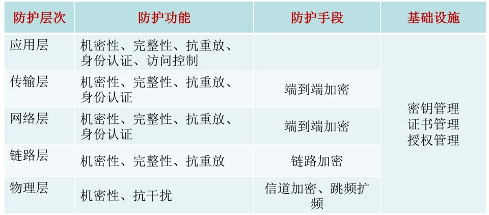
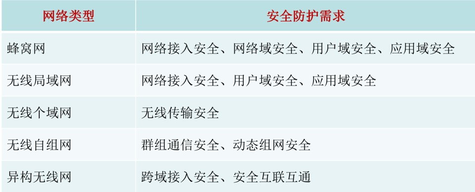
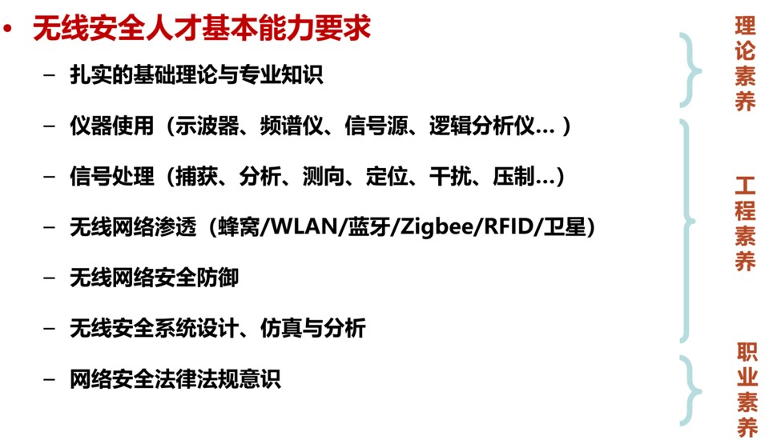

# 无线网络安全2-安全概述

## 无线通信安全范畴
所涉及频端以及对应的频端上承载信号。
本课集中讲**网络接入安全**和**数据传输安全**

### eg铁路网
- gsm-r ——> lte-r
- 铁路网 也建成了骨干网（共网） 可做ids

## 无线通信安全威胁

### 威胁0 信道开放性
- 无线天生不安全，无线链路传输难以物理隔离。
- 截取链路上的数据，属于被动攻击。 

信道上的数据都经过编码调制加密，我想拿的话需要逆向这个过程。

### 威胁1 抗干扰性差
- 受多种原因会发生信号衰落，导致误码率增大，丢包。

gps干扰：现在无人机有的用4、5g做图传、控制，传统的信号压制的干扰就不现实了，一启用，一片人用不了正常通信了。

 

### 威胁2 终端移动性
- 破解俘获节点，获取密钥，程序等机密信息， 冒充合法节点接入。

移动的节点，要考虑：抗俘获 防丢失 对抗逆向

自组网的系统，需要考虑卧底问题，监测、避免这个问题

越南，训练猴子捡传感器还行

### 威胁3 安全机制不健全
- 破解加密机制

典型示例：绵羊墙、降维攻击、中间人攻击(去年老师研究生有做 论文 无线安全)

## 无线通信攻击方式

- 无线窃听/假冒/篡改

- 针对wifi的攻击：蜜罐 吸引攻击流量 思路：钓鱼

- 针对emsi
    stingray 美国公司的产品 国内叫侦码仪 手机 emsi(emsi可以定位 黑产)
    测试方式：本地部署一个gsm网络 本地用 (技术成熟、飞入百姓家)

- gsm三种安全机制
    不加密 弱加密 强加密

- 重放攻击
    汽车/车库门/遥控小汽车 滚动码

    大多处于成本/时间开销考虑，如40bit密钥的计算开销  安全机制不完善

    因此设计协议需要考虑：抗重放（随机数 时间戳 同步序列数）

- 信号劫持
    协议层做阻断 压制 挤下线
    虚拟去附着信令 (基站/信令)进入去附着的模式 攻击者可利用、人为发去附着信令

    通信层做阻断 发射特定频段。干扰：发噪声/录音

    合法环境拉入虚假环境
    
    协议上的规定 4g信号差时 cfsb机制

## 防护策略

- 机密性保护
    用户业务数据
    用户信令信息
    身份和位置信息
- 完整性保护
    连接完整性
    无连接完整性
    选域完整性
- 身份认证
    实体认证
    数据源认证

### 访问控制 

身份的标示 涉及策略

### 不可否认性保护

消息否认：公钥密码是核心

//面试题：宏观上问你 最次从osi这个角度 害怕把你问住

### 不同协议层次の安全防护措施

### 不同网络の安全防护措施

- 蜂窝网：从终端到应用

- 局域网：路由不需要关注，可看作是单跳链路

- 异构无线网
    如3G时代的3gpp-wlan(cmccedu)，移动蜂窝网与移动wlan间的互通
    作为典范：协议上设计很好 业务切换容易；但用的不多。。也不流畅

---

# 1.2 无线和移动网络安全问题

- 自身特点造成

电还供着 关机也可以窃听器

工业部门的控制网络 仍是有线 在向无线网络发展；提工业互联网，即将无线技术应用到工业控制上

安全考量 贸然上不靠谱 有线网物理隔离都防不住

- 攻击平台

WarDriving 数据处理 红色

无人机 飞一下 侦察wlan 树莓派

进一步 抓握手包 做安全强度的关系 破解设备没到位 需要密码计算平台 fpga/gpu服务器做密码破解 解密 可作为课题

# 无线安全人才需求

# 作业
留了对4G网络的攻击方式总结 见论文
这个团队 针对5g也适应 19年也有会议
最后一个作者 大老板
