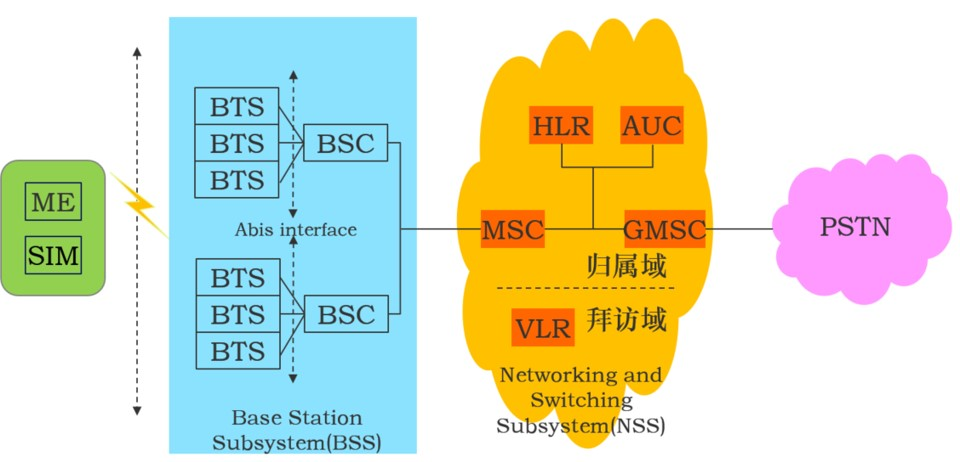

# 无线网络安全3-移动通信网概述

## 第一代移动通信 
本质上只是接入网，不是核心网，安全性脆弱/几乎无安全：容易克隆、窃听、空口信令/业务数据都是明文传输

基站、空中接口、空口安全是重点

//几个关键词： machine to machine eMTC NB-IOT KSSI Keyfob RFNOC 433MHz 315M??

## 第二代移动通信
蓝色

基站子系统 通过基站控制器 连接到子系统

先进的: 云平台的调用 对不同网络进行切片
不同网元间定义了很多接口 如这里的<BSC>

归属域 拜访域   Home/Visit

黄色上面有两个实体 HLR 归属位置寄存器
IMSI 国际移动业务标示 15位 运营商所持有 域共享关系(密码学 共享一个密钥对称 做认证、密钥协商)
IMEI
AUC 处理用户的认证请求 保存用户位置信息

GMSC
归属基站发寻呼消息找到我 用户跟新自己位置

VLR

## 3G标准

3G是分组交换 链路交互一起
ldd需要上行下行对称 频谱资源稀缺 分配连续频带困难 先进的可以非所称

Release99版本

对标准的称呼有很多说法

VOIP
IMS
呼叫流程发生改变

## 4G架构

U——UMTS
E——
层级很多——>减少层级结构(好处：信令时延要求 降低信号处理周期 eNB通过x2接口连接)
一部分3G的功能下放了

接入网 结构/拓扑 MES? 
很多个UE 不用先上RSC/移动交换中心来切换 切换时延也大大降低

核心网部分：

    MME 移动信管理实体 漫游认证承载管理 主要处理信令
    切换产生的信令

    第二个实体：Serving GW 主要处理业务数据 看流图的走向可以看出两个出来到核心网

    PDN-GW分组数据网关 

HSS 涵盖了2G中的xxx功能 认证 保存用户认证信息 生成认证向量

4G特别强调了异构网络的融合

架构图：

扁平化网络 减少数据传送的时延
