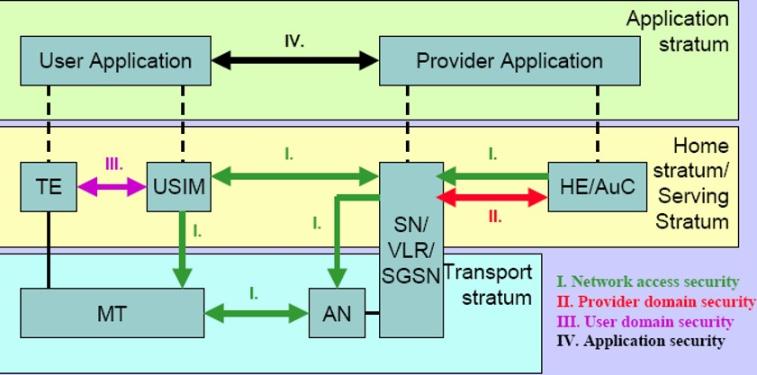
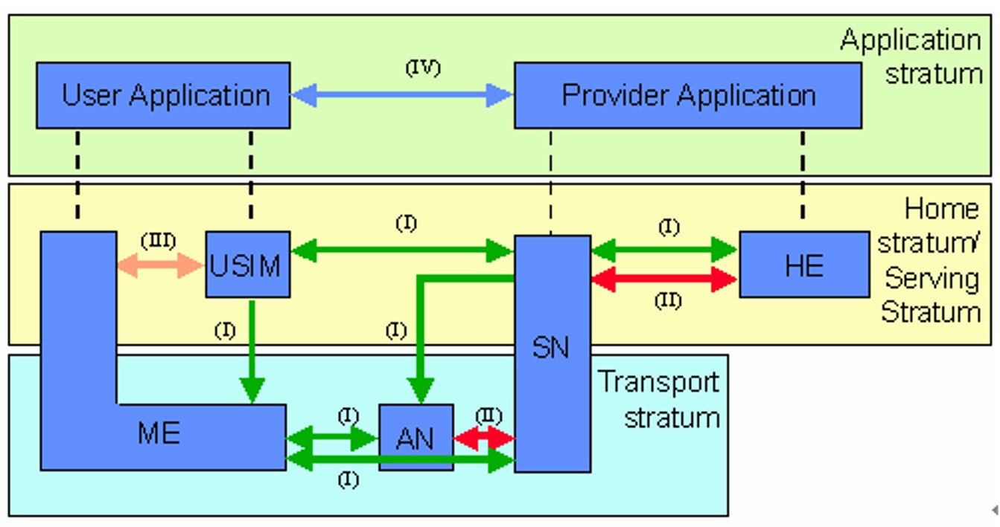

# 无线网络安全4-3G、4G安全体系与问题

### 3G的安全目标

- 确保用户生成的信息不被滥用或盗用
- 确保服务网络(SN)和归属环境(HE)
- 提供的资源和业务不被滥用或盗用
- 确保标准化的安全特征适用于全球，至少存在一个加密算法可以出口到各国
- 确保3G安全特征的实现和机制能随着新的威胁和新的业务的出现扩展和增强，即有好的可扩展性
- 相对2G，3G需要更强或更灵活的安全机制，如用户认证、无线接口加密、用户身份保密等

### 3G安全架构

MT modile termimal 终端设备
AN 

服务网络

### 3g认证鉴权过程

ppt 45；

[思考]：若都与认证中心交互，认证中心就会成为性能瓶颈

## LTE安全架构

### 安全问题

向下兼容带来的安全降级

上网 分组业务；电话 话音业务

## 解决

协议形式化工具 搭环境验证
上次LTE方向的论文中，思路也是如此

密码学、形式化工具：【proverif】

4G的改进：
强调了安全加载或启动
可信环境存密钥

攻击案例的总结 有个word 不详细