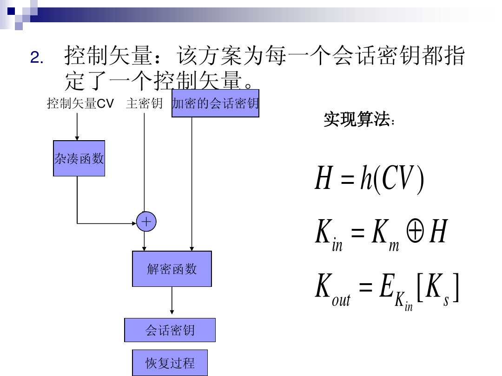

# 计算机与网络安全4-用对称密码实现保密性

上节课讲的两种加密逻辑用于传输保密性：

##### 链路加密 
实现/优点：
    在每一跳间加密 端口在payload中 可保护对抗流量分析

缺点：
    每一跳/中间节点都能看到传输内容 消息在节点公开

##### 端对端加密 

加密消息内容

端到端加密的情况下，PDU的控制信息部分不能被加密，否则中间结点就不能正确选择路由。

因此不抗通信量分析：
    通信量分析主要分析数据从哪里来、到哪里去、什么时候发送传送多少时间、发送频繁程度等。

详细解释（题库）：<https://books.google.com/books?id=uc_R7NIdF5UC&pg=PA91&lpg=PA91&dq=端对端加密+通信量分析&source=bl&ots=AbmNmmS0fs&sig=ACfU3U3t7BPUA90nlO_LcIUJxKUMma7ZRA&hl=en&sa=X&ved=2ahUKEwjRnpGjpIvhAhWSfXAKHb_KC2YQ6AEwB3oECAMQAQ#v=onepage&q=端对端加密%20通信量分析&f=false>

## 密钥管理(密钥分配)

引申而来了的需求：密钥保护 密钥管理

引入KDC、层次式密钥(网络规模效率、降低风险两个角度)

### **重点：对密钥分配方法的分析**

密钥分配模式，//实用安全讲过，ppt有详细介绍。

    N1 随机数 防篡改 确认对方是KDC且知道Ka
    相当于挑战应答机制

    [思考]: 没有N1，攻击者可以做到什么？
    对A可以重放攻击： A发送的IDa、IDb，固定，不知道收到的request是否是这次还是上次发的
    

    Figure7.9的步骤4-5，让A对B有Ks也有了确认

    [思考]: Ks保护不好，泄露了的后果？
            Ks过期了，会导致什么攻击？
    因此需要：过期会话密钥

### 会话密钥的生命期
- 在安全性与通信时间之间折衷考虑
- 对面向连接的协议，改变连接时，改用新的ks
- 对非面向连接的协议，定期更改。

### 安全分析得到的启发

网络安全，靠协议交互达到安全的目的

攻击层面，figure7-9这个协议并不安全

协议设计，是复杂的

因此需要设计基于可证明安全性的方法，如使用状态机转移，证明协议是否安全

### 一种透明的密钥控制方案
用户无感的密钥分发
p24页ppt

### 密钥的使用方法
- 会话密钥的类型
- 密钥标志法(flag) 优缺点 eg.DES的8个校验位
- 控制矢量法 流程图见https://wenku.baidu.com/view/d4ff9f41be1e650e52ea99fa.html的

## 随机数

- 随机数的使用
    1. 临时交互号，用于防止重复攻击
    2. 会话密钥产生
    3. RSA算法中密钥的产生

- 伪随机数的产生
    - 要求：随机性和不可预测性
    - 来源：算法生成，如Lehmer算法通过迭代方程
    - 分析：随机性分析、改进方法

- 用密码编码学方法生成随机数
    - 循环加密
    - DES输出反馈模式
    - ANSI X9.17伪随机数发生器

## 公钥体制开了个头，见下章

参考：https://wenku.baidu.com/view/d4ff9f41be1e650e52ea99fa.html