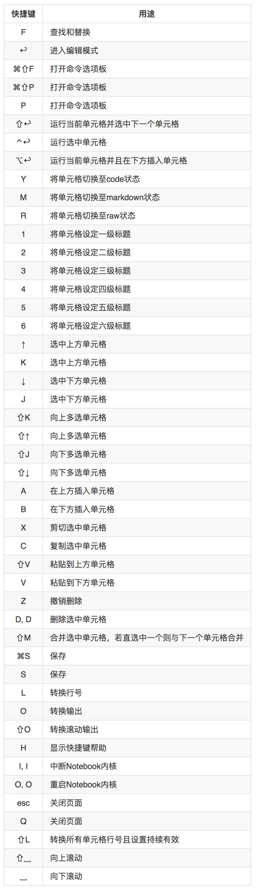

# Jupyter Notebook

## 优势：共享

### File->Download as

1. 下载为HTML文件:
    与别人(客户)分享我的数据分析成果

2. 下载为Python（.py）模块
    为了将自己的数据分析成果和代码嵌入到项目中，成为子模块，方便和其他开发人员共同完成任务。比如为管理系统做的数据分析子模块

3. 导出Markdown格式
    在博客或文档中使用 notebook

### 应用场景

调debug代码的时候可以随时随地print，在任何地方进行操作，查看各种可能的bug。

另一个应用场景是生成一个【教学文档】，学生们可以随时改里面的代码，你做了什么功能也非常清晰。 而且同时支持LATEX，你可以写一个特别好看的文档，像一个自带代码的MINI PAPER一样。

练习可见本目录下的：
<Jupyter-Notebook练习-lab00_BerkeleyX_exercise.ipynb>

## 需要配合的py包

1. 环境自动关联包，该包可以将conda中创建的环境自动关联到你的notebook中。
    conda install nb_conda

问题：
    环境名python2没有出现在notebook的new中。
解决：
    安装包ipykernel：选择conda选项卡-选中python2-搜索ipykernel-点击右箭头安装
    （在其他新建环境下也要像刚才步骤那样安装一次ipykernel包）
    增加内核——“ipykernel” 

2. jpython的代码补全：
    conda install pyreadline

## 样子

0. 顶部的3个选项卡是：Files（文件）、Running（运行）和 Cluster（集群）

1. Files（文件）显示当前“notebook工作文件夹”中的所有文件和文件夹。

2. Running（运行）选项卡会列出所有正在运行的 notebook。可在该选项卡中管理这些 notebook。
    Running页面主要展示的是当前正在运行当中的终端和“ipynb”格式的笔记本。若想要关闭已经打开的终端和“ipynb”格式的笔记本，仅仅关闭其页面是无法彻底退出程序的，需要在Running页面点击其对应的“Shutdown”。

3. Clusters一般不会用到。因为过去在Clusters(集群)中创建多个用于并行计算的内核。现在这项工作已由`ipyparallel`接管。

4. cell
    打开代码区后，可以看到外框为绿色的一个小方框。它称为单元格。单元格是你编写和运行代码的地方。

    当Cell前出现`*`，表示当前cell程序正在运行，或者它前面的cell正在运行。后面的单元格等待运行，不会出结果

## 日常使用

1. ctrl+enter键执行代码

2. 再运行一遍：kernel-restart

3. 加载指定网页源代码（ctrl+enter来执行命令）
    
    %load URL

4. 加载本地Python文件（ctrl+enter来执行命令）

    %load Python文件的绝对路径

5. 直接运行本地Python文件

    %run Python文件的绝对路径
    !python3 Python文件的绝对路径
    !python Python文件的绝对路径
    ！属于 !shell命令 语法的使用，即在Jupyter Notebook中执行shell命令的语法。

6. !shell命令

    %pwd
    !pwd

注意1：关闭notebook服务器后，下次启动再打开notebook，当你继续在该notebook中写代码时，发现之前的变量无法访问了。需要你在该notebook的Kernerl选项卡中选择“Run All”重新编译下之前的代码。

### 快捷键

两种模式：

① 命令模式
可以通过组合键运行笔记本的命令。
按esc键进入命令模式。
命令模式下，单元格边框为灰色，且左侧边框线为蓝色粗线条。

F 查找和替换

② 编辑模式
编辑模式使用户可以在单元格内编辑代码或文档。
按enter或return键进入编辑模式。
编辑模式下，单元格边框和左侧边框线均为绿色。

还有：  

## 启动
    
    jupyter notebook -h
    jupyter notebook
    jupyter notebook --port <port_number>
    jupyter notebook --no-browser

启动后的默认打开文件夹：

    修改jupyter_notebook_config.py配置文件中的默认打开目录：`c.NotebookApp.notebook_dir: `

便捷获取配置文件所在路径的命令(一般配置文件名为jupyter_notebook_config.py)：
`jupyter notebook --generate-config`

//这时只有从终端中输入命令jupyter notebook打开Jupyter Notebook，才会进入上一步修改的目录。从win快捷方式进入还是Home目录。

## 关闭

1. Files中勾选想要关闭的“ipynb”笔记本。
    正在运行的笔记本其图标为绿色标有“Running”，点击上方的黄色的“Shutdown”按钮。

2. 进入“Running”页面关闭对应Notebook。这个方法可以关闭终端或笔记本。

## 其他

### markdown目录
Jupyter Notebook无法为Markdown文档通过特定语法添加目录，因此需要通过安装扩展来实现目录的添加。

    conda install -c conda-forge jupyter_contrib_nbextensions

导航栏多了“Nbextensions”的类目，点击“Nbextensions”，勾选“Table
of Contents ⑵”；之后再在Jupyter-Notebook中使用Markdown，点击下presentation旁边的图标即可使用。

### Markdown在文中设置链接并定位
在使用Markdown编辑文档时，难免会遇到需要在文中设定链接，定位在文档中的其他位置便于查看。因为Markdown可以完美的兼容html语法，因此这种功能可以通过html语法当中“a标签”的索引用法来实现。

语法格式如下：

    [添加链接的正文](#自定义索引词)
    <a id=自定义索引词>跳转提示</a>

### 隐藏笔记本输入单元格

在Jupyter Notebook的笔记本中无论是编写文档还是编程，都有输入（In []）和输出（Out []）。当我们编写的代码或文档使用的单元格较多时，有时我们只想关注输出的内容而暂时不看输入的内容，这时就需要隐藏输入单元格而只显示输出单元格。

方法一
        
    from IPython.display import display
    from IPython.display import HTML
    import IPython.core.display as di # Example: di.display_html('<h3>%s:</h3>' % str, raw=True)

    # 这行代码的作用是：当文档作为HTML格式输出时，将会默认隐藏输入单元格。
    di.display_html('', raw=True)

    # 这行代码将会添加“Toggle code”按钮来切换“隐藏/显示”输入单元格。
    di.display_html('''<button onclick="jQuery('.input_area').toggle(); jQuery('.prompt').toggle();">Toggle code</button>''', raw=True)

在笔记本第一个单元格中输入以上代码，然后执行，即可在该文档中使用“隐藏/显示”输入单元格功能。

缺陷：此方法不能很好的适用于Markdown单元格。

方法二

    from IPython.display import HTML
    HTML('''
    <form action="javascript:code_toggle()"><input type="submit" value="Click here to toggle on/off the raw code."></form>''')

在笔记本第一个单元格中输入以上代码，然后执行，即可在该文档中使用“隐藏/显示”输入单元格功能。

缺陷：此方法不能很好的适用于Markdown单元格。
