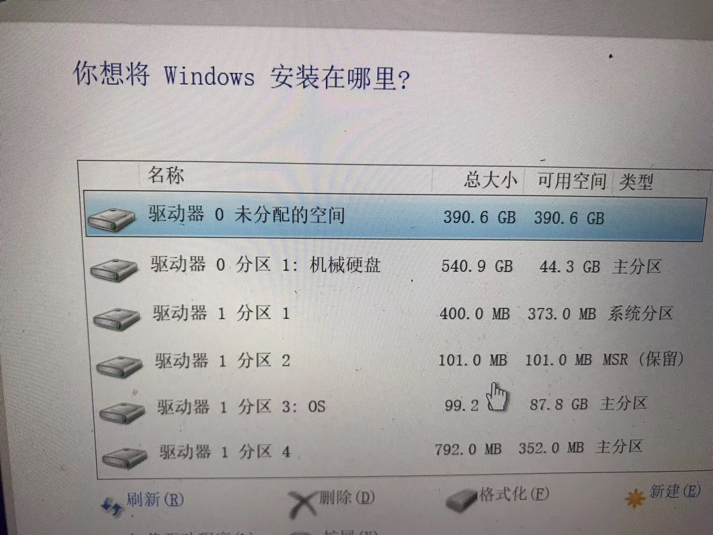

# 开发-数据安全


## 所用开发环境要稳定

重要、长段代码最好不在jupyter中开发；它只是使用checkpoint保存到了temp文件夹。temp文件夹存留不稳定

朋友李<>在数模，时电脑死机后jupyter未提供返回到上一个保存点的缓存。


因此：

生产环境要稳定 ；及时保存；且及时备份存档；


## 回退前做好备份

GitHub的revert


## 提交

提交的对方(Web)环境不确定，宁愿提前，不能拖到最后一天！

```
很抱歉，系统维护中
```


## 重装系统时手贱删错区。



