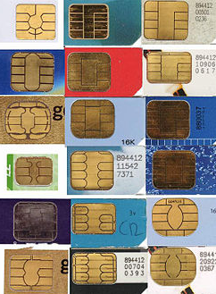
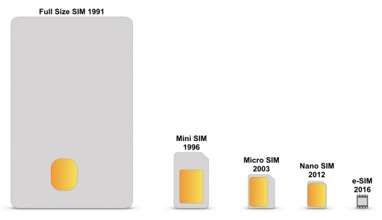
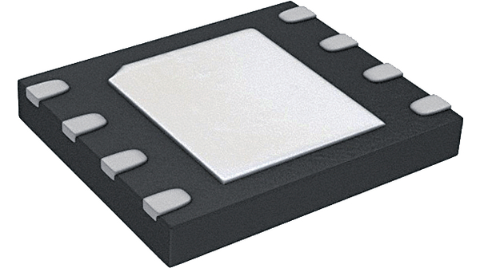
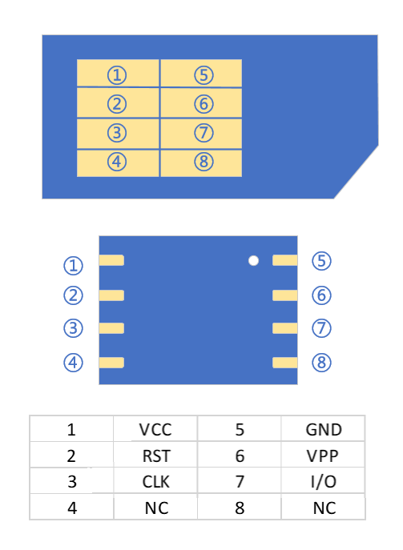
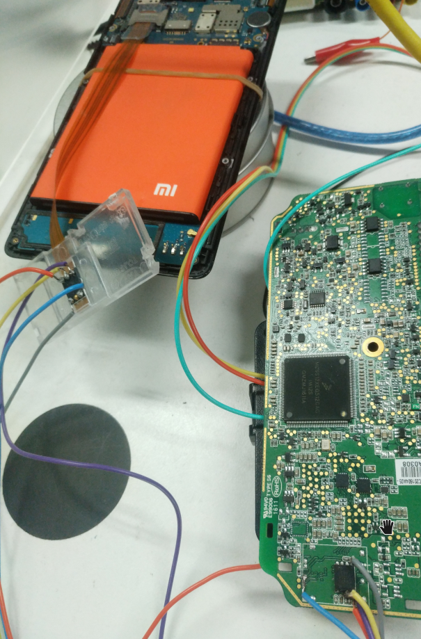

# 无线学习-esim

## SIM卡

SIM(subscriber identification module, 客户识别模块)，是一个能安全储存移动通讯配置的IC。

SIM卡是2G网络时代下的叫法，因为SIM由硬件和软件组成。

3G时代，SIM变成了纯应用程序，和CSIM，USIM一样，可以运行在UICC里面  
//UICC(universal integrated circuit card,通用集成电路卡)，即手机里插的所谓SIM卡，属于IC智能卡的一种。

//SIM卡的叫法沿用至今，是不准确的，应该叫UICC，但为用户体验，厂商还是称作SIM卡，所以后面说的SIM卡指UICC智能卡。

### 存储

SIM卡有数据存储的功能，存放用于识别和验证客户端的配置信息。

- [ICCID](https://en.wikipedia.org/wiki/Subscriber_identity_module#ICCID)(integrated circuit card identifier，IC卡识别码)

- [IMSI](https://en.wikipedia.org/wiki/International_mobile_subscriber_identity)(international mobile subscriber identity，国际移动用户识别码)

- [Authentication Key]是GSM网络下的一个128位鉴权key，因为GSM算法存在漏洞，导致key被泄漏，从而可以复制SIM卡。

//目前找回丢失手机原理，就是通过查IMEI对应的ICCID锁定手机号，这个ICCID就是新插入SIM卡的识别码。

### IC类型

SIM卡的IC包括CPU、ROM、RAM、EEPROM和I/O，尺寸也是越做越小，直到2016年出现的e-SIM。

## e-SIM
嵌入式SIM卡，Embedded-SIM/embedded universal integrated circuit card / eSIM / e-SIM，也叫eUICC。是芯片格式的SIM卡，大多数采用SON-8封装。 

eSIM是下一代SIM卡技术，遵循GSMA(全球移动通信系统协会，GSM Association)规范，核心思想是将SIM卡硬件(eUICC)的生产与运营商数据(Profile)的生产分离。 运营商通过空中写卡方式将Profile下载，非常安全，不会被中间人攻击。

### 优点：

1. 摆脱SIM卡限制，方便携号转网。
2. 包含其他安全信息，可以进行私有网络认证。
3. 弃用卡槽和IC卡。成本降低，节省空间。
4. 在运营平台就能开卡，压缩了制卡的流程。

### 局限：

1. 不支持双卡双待。
2. 目前国内集成eSIM卡的设备，普遍由运营商或指定网络服务方牵头的，无法转网；所以目前只有物联网设备使用eSIM。

### Security

安全方面，SIM卡使用的是单向鉴权机制：在接入网络时只对SIM卡做身份认证；曾有黑客表示可以在短时间内远程控制任何一个SIM卡号码，甚至复制。

而USIM卡使用的则是双向鉴权机制：通过AUTN（认证令牌）实现用户和网络的鉴权，接入网络时不仅对USIM卡进行身份认证，USIM卡同时也要对网络进行身份认证，因此可大幅提升破解难度，还能有效地识别或屏蔽伪基站，提升网络通讯的安全。

### 引脚
eSIM与SIM卡的引脚定义：

根据引脚定义可以把eSIM飞线到SIM卡槽上，VPP引脚可以不接。见下图：

refer:
google: usim esim
<https://gorgias.me/2017/12/10/eSIM学习笔记/>
<https://wenku.baidu.com/view/dfc28735a9114431b90d6c85ec3a87c240288aaf.html?from=search>
